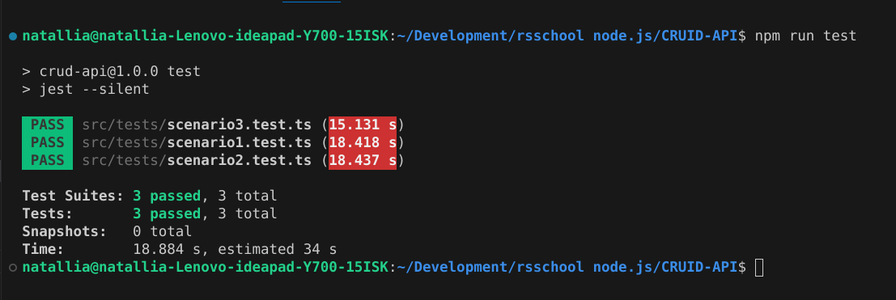

# PREREQISITES

1. Task: Simple CRUD API (https://github.com/AlreadyBored/nodejs-assignments/blob/main/assignments/crud-api/assignment.md)

2. Done 21.10.2024 / deadline 22.10.2024

3. Score: 222 / 222

# IMPORTANT!

1. Do not forget to disable caching in your browser or any other tool you will use to check my project!

2. Create .env-file (.development.env is an example of how to)

# TESTING

1. .env-file is used to read PORT for testing purposes

2. Start the project (npm run start:dev, for example)

3. Start test suites (npm run start test / npm run start test:verbose)

4. Tested on Windows 10 (work computer and home notebook) and on Ubuntu 22